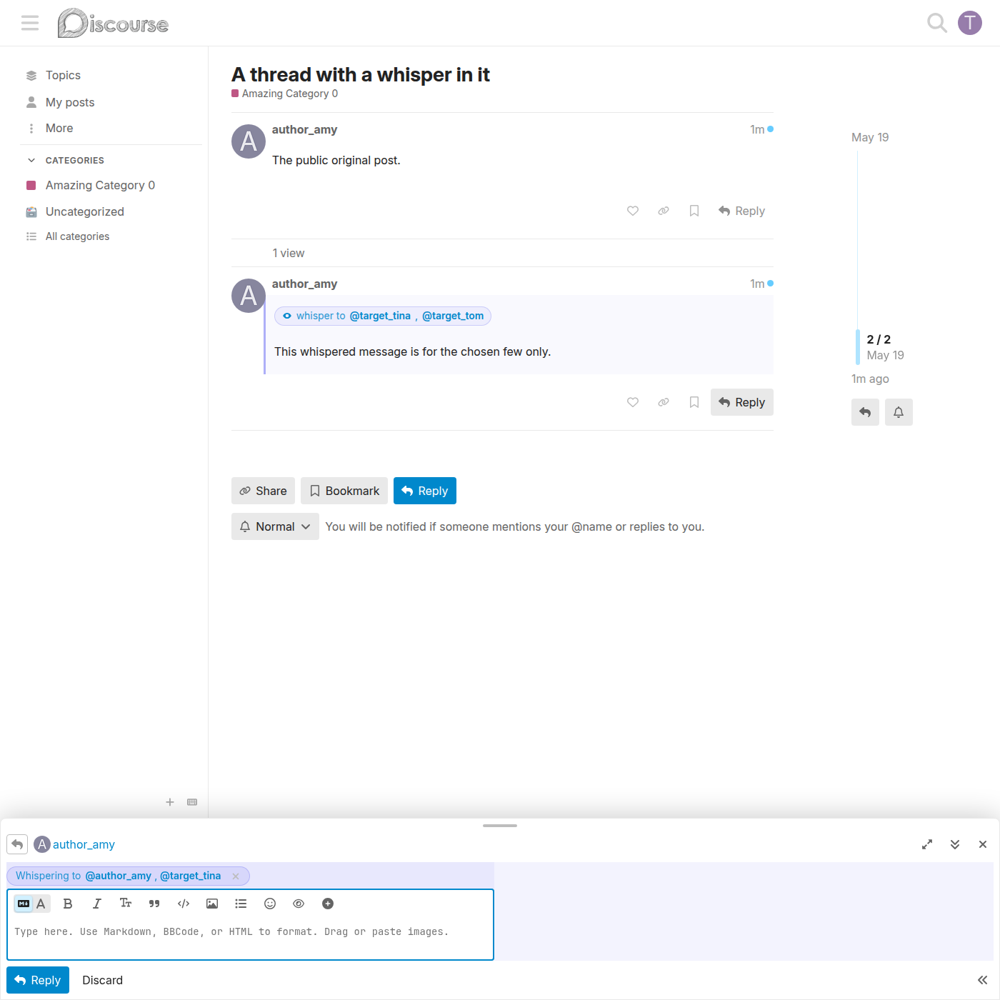

# Auto-whisper-back on reply

Replies to a whisper are pre-armed as whispers back to the rest of the original audience, so a private exchange stays private without the replier having to re-arm it.

## How it works

When a recipient (or the author) opens the composer to reply to a whisper post, the plugin listens for `composer:opened`. If the post being replied to is a whisper, it builds the reply audience as:

> the original **author** plus every **target** from the whisper, minus the **current user**.

The composer opens with that audience already armed — the indigo whisper pill is shown before the replier types anything.

## Behaviour

- If the current user is the **author**, the reply targets everyone originally whispered to.
- If the current user is **one of the recipients**, the reply targets the author plus the other recipients.
- The current user is always removed from the audience — nobody whispers to themselves.
- Nobody new is pulled in by default: the conversation stays in the same small group.
- The toolbar eye button still works — the replier can open the modal to adjust the audience, or click the pill's **✕** to cancel the whisper and post a public reply instead.

## Implementation

The audience is computed by the pure helper `assets/javascripts/discourse/lib/reply-audience.js` (`computeReplyAudience`), which de-dupes the author against the target list, skips falsy ids, preserves ordering, and is unit-tested with Node's test runner. The initializer wires it to the `composer:opened` app event.

## Related

- [Whisper a post](whisper-a-post.md) — arming a whisper from scratch.
- [Whisper visibility](whisper-visibility.md) — who can read the reply.
