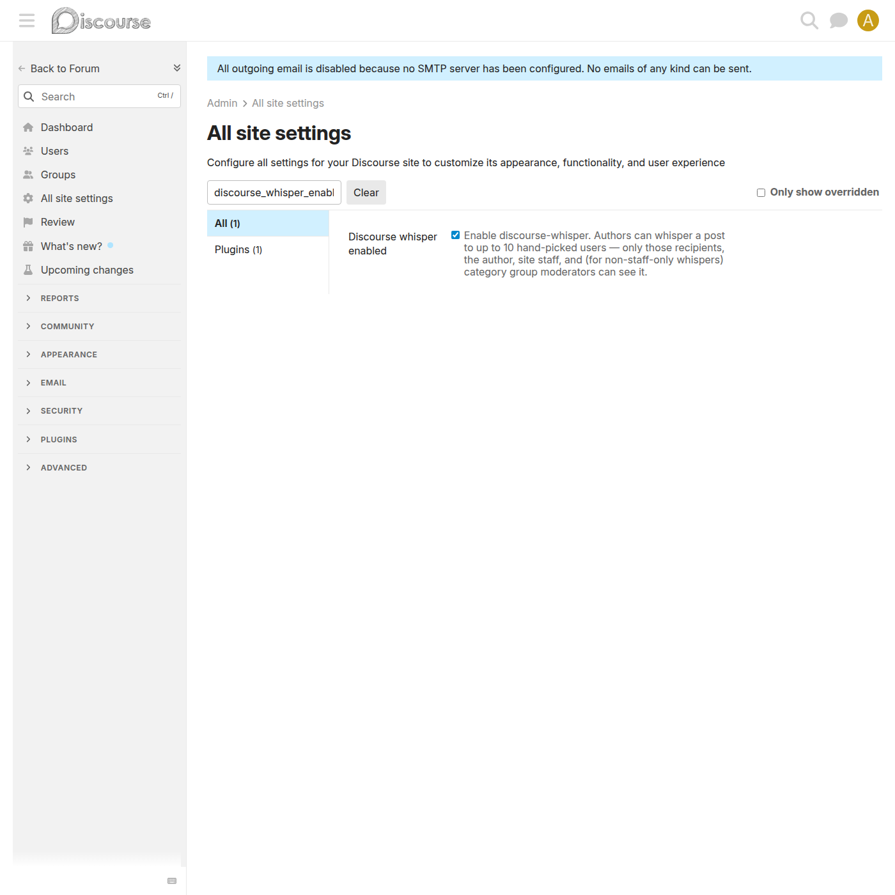

# `discourse_whisper_enabled` — master switch

Setting: **`discourse_whisper_enabled`** — boolean, default `true`, client-exposed.

The plugin's single site setting. It lives at **Admin → Site Settings → Discourse Whisper** (`/admin/site_settings/category/discourse_whisper`).

## What it controls

When **on** (the default):

- The 👁 eye button is added to the composer toolbar, and the mention hint and auto-whisper-back behaviours are active.
- `Guardian#can_see_post?`, the `TopicView` scope, the `Search` prepend, and the `WebHook` prepend all enforce whisper visibility.
- The post serializer exposes the `is_whisper_to_user`, `whisper_target_user_ids`, and `whisper_targets` attributes.

When **off**:

- The composer UI is not loaded — no eye button, no hint, no auto-arm.
- The visibility enforcement stops: existing whisper posts become ordinary posts visible to everyone, and the recipient banner is not rendered.
- The `whisper_target_user_ids` custom fields are **preserved on disk** — turning the setting back on restores the previous behaviour with no data loss.

## Enabling the plugin

1. Go to **Admin → Site Settings**.
2. Search for `discourse_whisper_enabled`.
3. Confirm it is ticked (it defaults to `true` on install).

## Related

- [Whisper visibility](whisper-visibility.md) — what the enforcement does when this is on.
- [Setup & Installation](setup.md) — installing the plugin.
