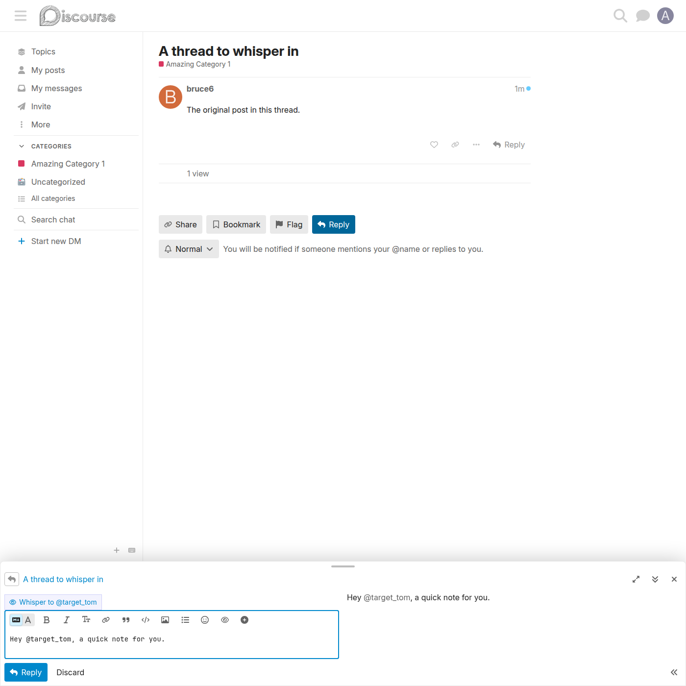
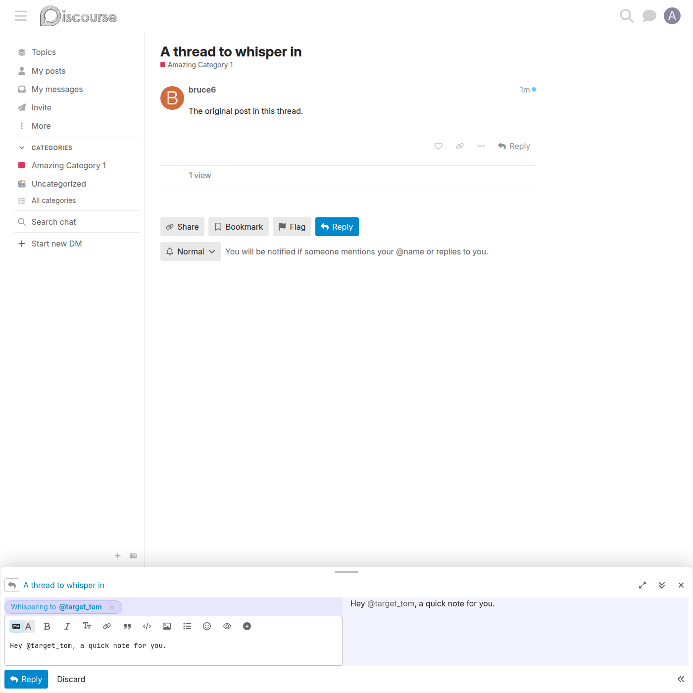

# Mention-integrated whisper hint

A shortcut that offers to whisper to whoever the author `@mentions` — no need to open the toolbar modal.

## How it works

As the author types in the composer body, the plugin watches for `@mentions`. When one or more mentioned usernames are **not already** in the whisper audience, a small pill button slides in below the composer.

### The hint pill appears

Typing `@username` makes the hint appear, reading **"Whisper to @username"**.

### Arming the whisper from the hint

Clicking the pill resolves those usernames to user ids and adds them to the whisper audience — the same composer state the toolbar modal produces. The armed whisper pill then appears.

## Behaviour

- The hint is **invisible until** an unarmed mention exists, so it never gets in the way.
- If a whisper is already armed, the label changes to **"Also whisper to @user"** — clicking it *adds* the new mentions to the existing audience rather than replacing it.
- Mention parsing is deliberately strict: email addresses, URL paths, backticked text, and mid-word `@` do not match; de-duplication is case-insensitive; usernames are capped at 60 characters.
- The author can always ignore the hint and post publicly, or use the toolbar eye button for the full picker.

## Implementation

The connector lives at `assets/javascripts/discourse/connectors/composer-fields/whisper-mention-hint.gjs` and tracks `composer.reply` reactively. Mention extraction is in the pure helper `assets/javascripts/discourse/lib/whisper-mentions.js`, which is unit-tested with Node's test runner.

## Related

- [Whisper a post](whisper-a-post.md) — the toolbar modal, the canonical way to arm a whisper.
