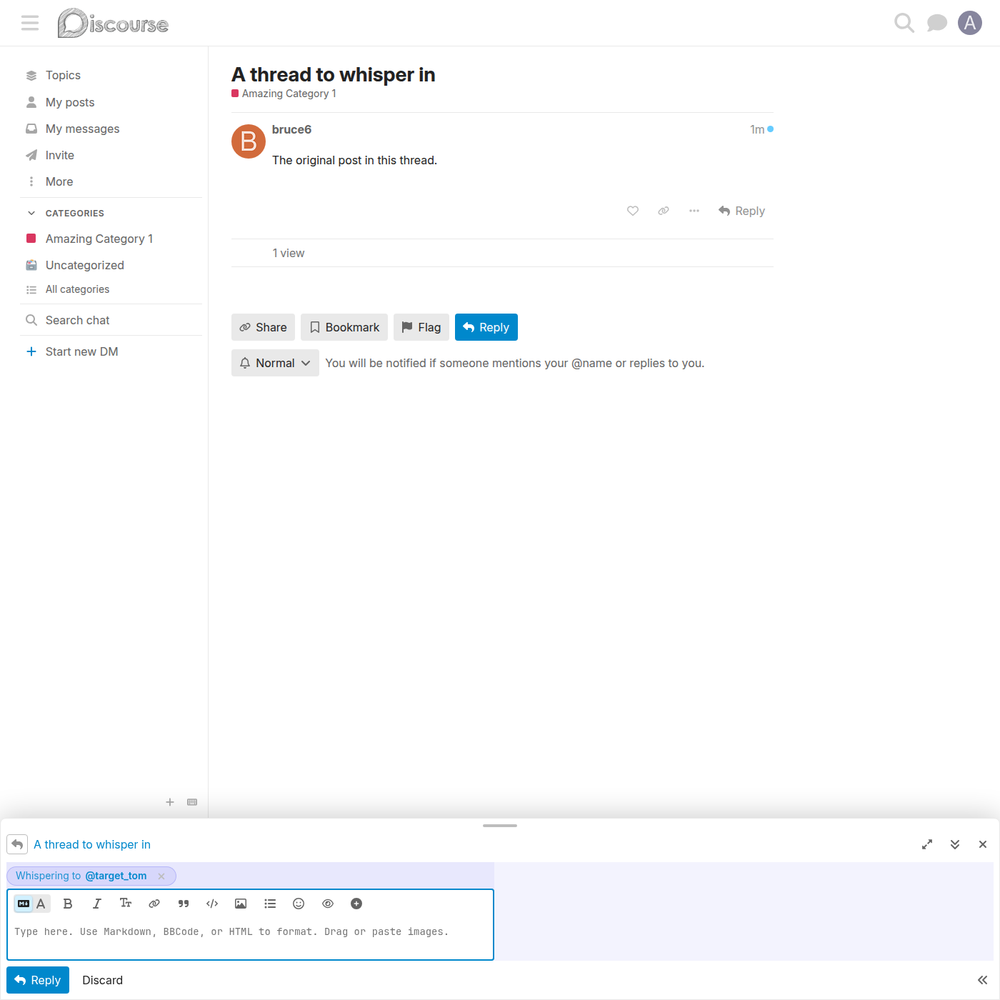
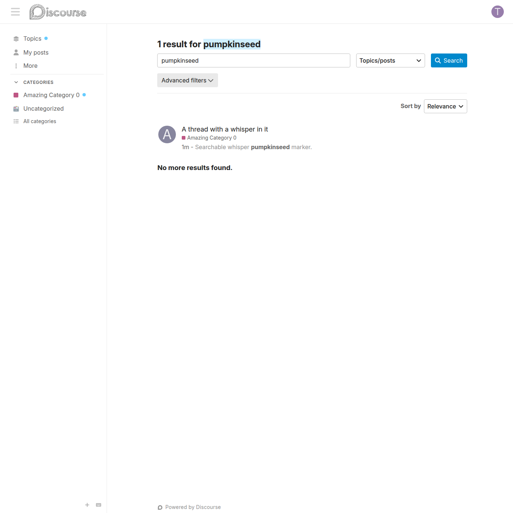
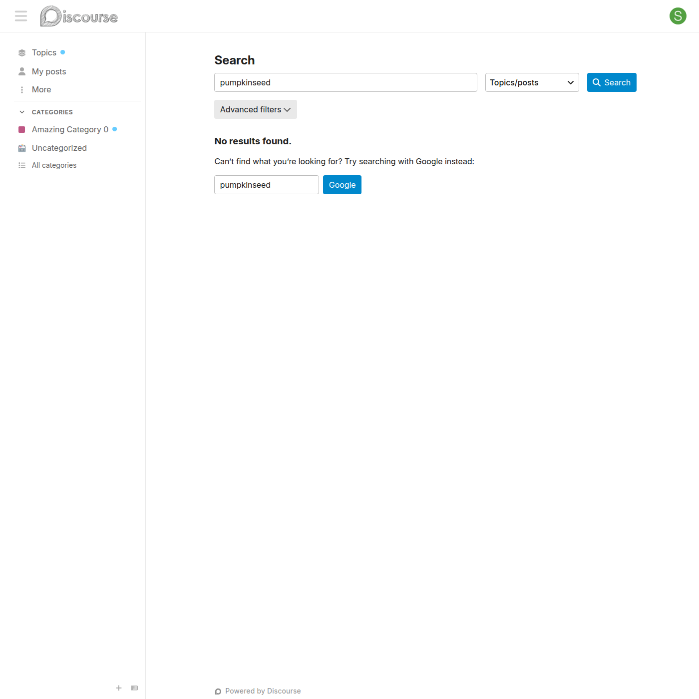

# Tests & screenshots

## Test suite

The plugin is covered by three CI workflows (see [`.github/workflows/`](../.github/workflows/)):

| Workflow | What it runs |
|---|---|
| **Plugin Tests** | `rspec` — `spec/lib` and `spec/serializers` (the Guardian visibility rule, the custom-field writer, the post serializer) |
| **Frontend System Tests** | `rspec spec/system` — Capybara/Playwright end-to-end specs; uploads the screenshots below as the `ui-screenshots` artifact |
| **Node helper tests** | `node --test test/node/run-helper-tests.mjs` — the pure-logic mention and reply-audience suites |

The system specs run in a real Chromium browser driven by Playwright. The CI workflow ([`frontend-tests.yml`](../.github/workflows/frontend-tests.yml)) clones `discourse/discourse`, mounts this plugin, builds the Ember assets, installs the Playwright browser, and runs `spec/system`. Every screenshot below is produced by a passing system spec, so they double as a visual regression record.

## Running the system specs

From a Discourse checkout with the plugin mounted at `plugins/discourse-whisper`:

```bash
LOAD_PLUGINS=1 bundle exec rspec plugins/discourse-whisper/spec/system --format documentation
```

Screenshots are written to `discourse/tmp/capybara/`. In CI they are published as the `ui-screenshots` artifact and committed into [`screenshots/`](../screenshots/).

---

## Whisper composer

End-to-end coverage for arming a whisper from the composer — [`spec/system/whisper_composer_spec.rb`](../spec/system/whisper_composer_spec.rb).

### The whisper eye button in the composer toolbar

The composer toolbar gains a 👁 eye button in the `extras` group — the entry point for arming a whisper.


### The empty "Whisper to…" modal

Clicking the eye button opens a modal with a multi-user picker, before any user is chosen.


### Recipients selected in the modal

The author picks up to 10 users as the whisper audience.


### The armed whisper pill above the composer

After confirming, an indigo "Whispering to …" pill appears above the composer and the fields pick up a pale indigo tint.


### The posted whisper, author view

Once posted, the whisper shows with the 👁 `whisper to …` banner and a soft indigo left border.


### The mention hint pill

Typing an `@mention` that is not yet in the audience makes a "Whisper to @username" hint pill appear below the composer.


### A whisper armed via the mention hint

Clicking the hint resolves the mentioned users and arms the whisper — the same composer state the modal produces.


### The armed pill, before it is cleared

An armed whisper pill in place, about to be cleared with its ✕ button.



---

## Whisper visibility

End-to-end coverage for who can see a whisper across every read path — [`spec/system/whisper_visibility_spec.rb`](../spec/system/whisper_visibility_spec.rb).

### A recipient sees the whisper

A target recipient sees the whisper post in the topic stream with its banner and indigo border.


### A non-recipient does not see the whisper

A regular user not in the audience sees the topic with the whisper post simply absent — no placeholder, no gap.


### A site admin sees the whisper for oversight

Admins always see whispers so they can review or flag them.


### A site moderator sees the whisper for oversight

Moderators have the same oversight visibility as admins.


### A multi-recipient whisper banner

When a whisper has multiple recipients, the banner lists each one as a profile link.


### A reply composer auto-armed with a whisper back

Opening the composer to reply to a whisper pre-arms a whisper back to the rest of the original audience.


### A recipient finds the whisper in search

A recipient searching for text inside a whisper gets the post back in the search results.



### A stranger does not find the whisper in search

The same search as a non-recipient returns nothing — the whisper is filtered out of search hits.



### A category group moderator sees the whisper for oversight

A category group moderator of the post's category sees mixed-audience whispers in that category.


### With the plugin disabled, the whisper is visible to all

When `discourse_whisper_enabled` is off, whisper posts become ordinary posts visible to everyone, with no banner.


### The admin site setting

The plugin's single master switch, `discourse_whisper_enabled`, under the Discourse Whisper settings category.


---

## RSpec unit & serializer specs

The non-browser specs live in [`spec/lib/`](../spec/lib/) and [`spec/serializers/`](../spec/serializers/):

- **`guardian_extensions_spec.rb`** — every branch of the `Guardian#can_see_post?` visibility rule: plugin disabled, single- and multi-target whispers, author / target / admin / moderator / category-group-moderator / stranger / anonymous viewers, staff-to-staff whispers, and malformed stored values.
- **`post_custom_fields_spec.rb`** — the `before_create_post` handler that writes the `whisper_target_user_ids` custom field: de-duplication, the `MAX_WHISPER_TARGETS` cap, and defensive drops for bogus ids.
- **`post_serializer_spec.rb`** — the `is_whisper_to_user`, `whisper_target_user_ids`, and `whisper_targets` serializer attributes.

```bash
LOAD_PLUGINS=1 bundle exec rspec plugins/discourse-whisper/spec/lib plugins/discourse-whisper/spec/serializers
```

## Node helper tests

Pure-JS helpers under `assets/javascripts/discourse/lib/` are exercised with Node's built-in test runner — no browser, no Ember:

```bash
node --test test/node/run-helper-tests.mjs
```

These cover the `MENTION_RE` regex, `pendingMentions`, and `computeReplyAudience` — including edge cases like email-vs-mention, non-ASCII, case-insensitive de-duplication, and the 60-character cap.

## Why GitHub Actions

The workflows are self-contained — no Docker image, no pre-baked environment, no local Discourse checkout required. Each run spins up a fresh Postgres + Redis on the runner, clones Discourse and this plugin side-by-side, and runs the suite. A green check on a PR is authoritative, tied to a specific commit SHA. For rapid local iteration, run `rspec` inside the `discourse/discourse_dev:release` Docker image instead.
