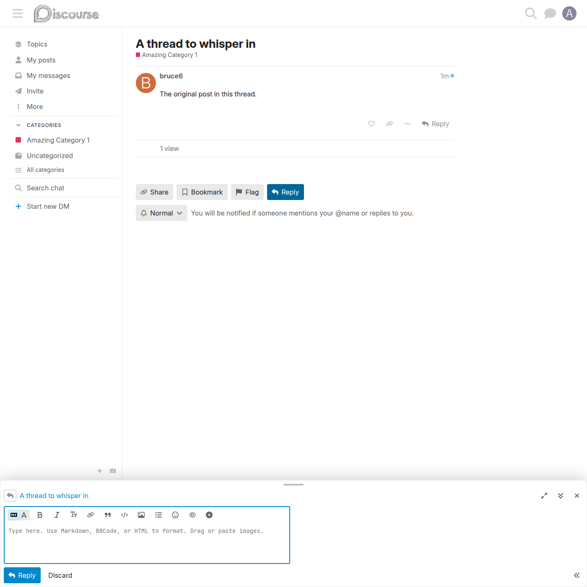
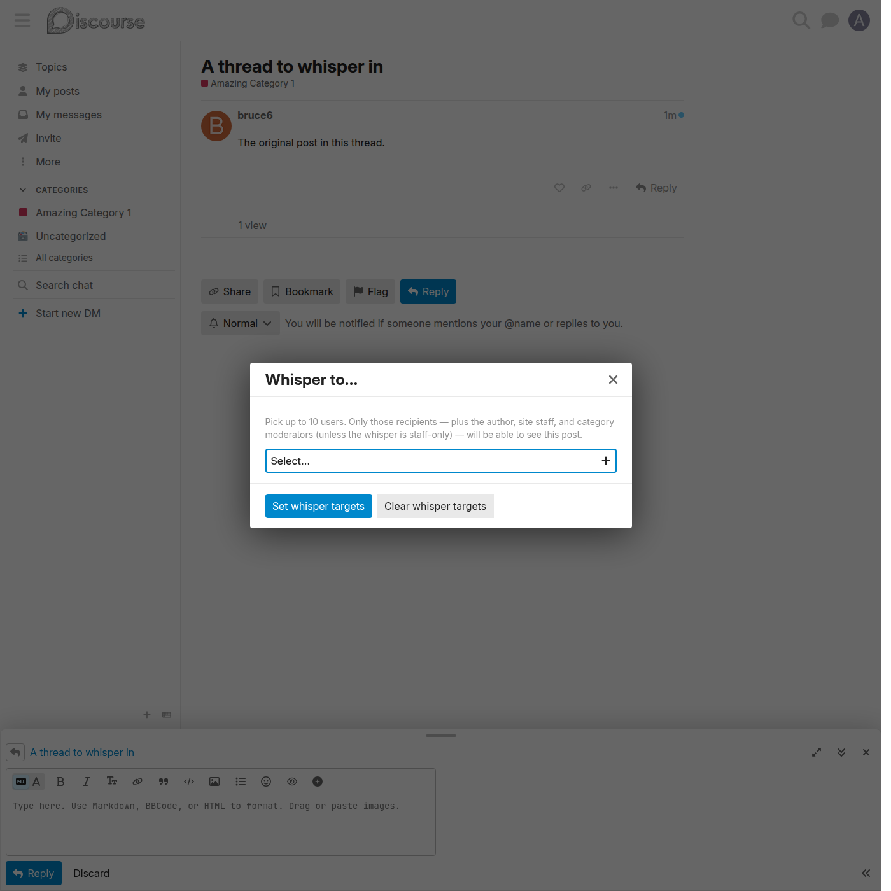
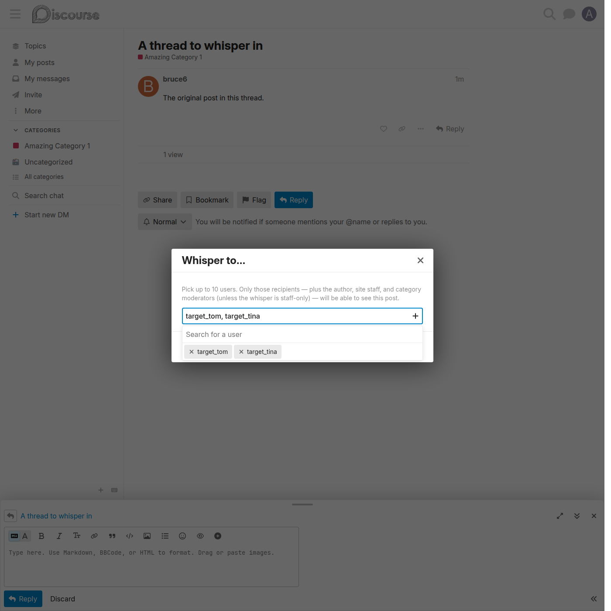
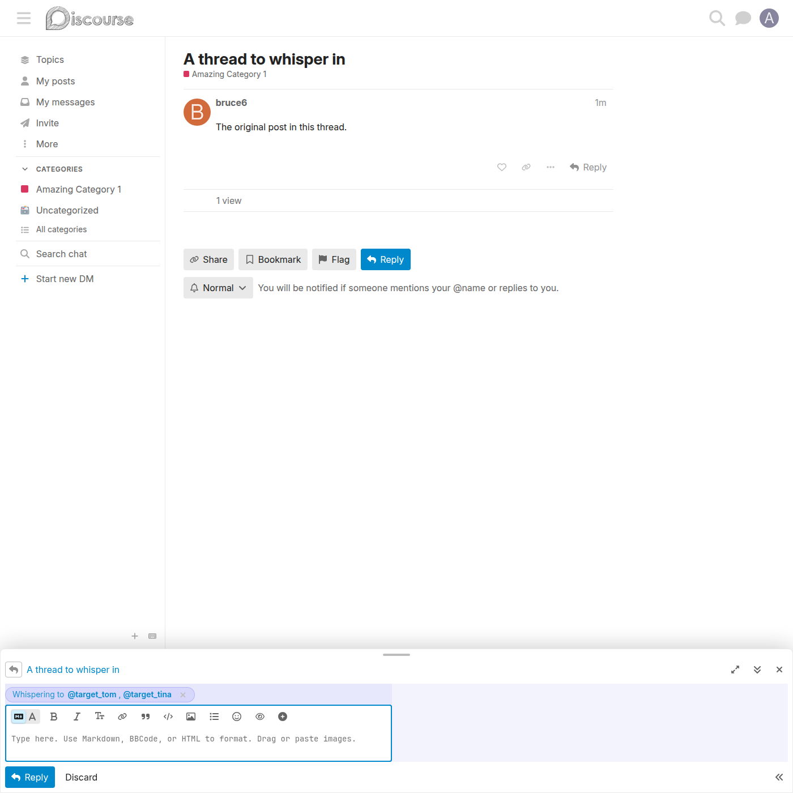
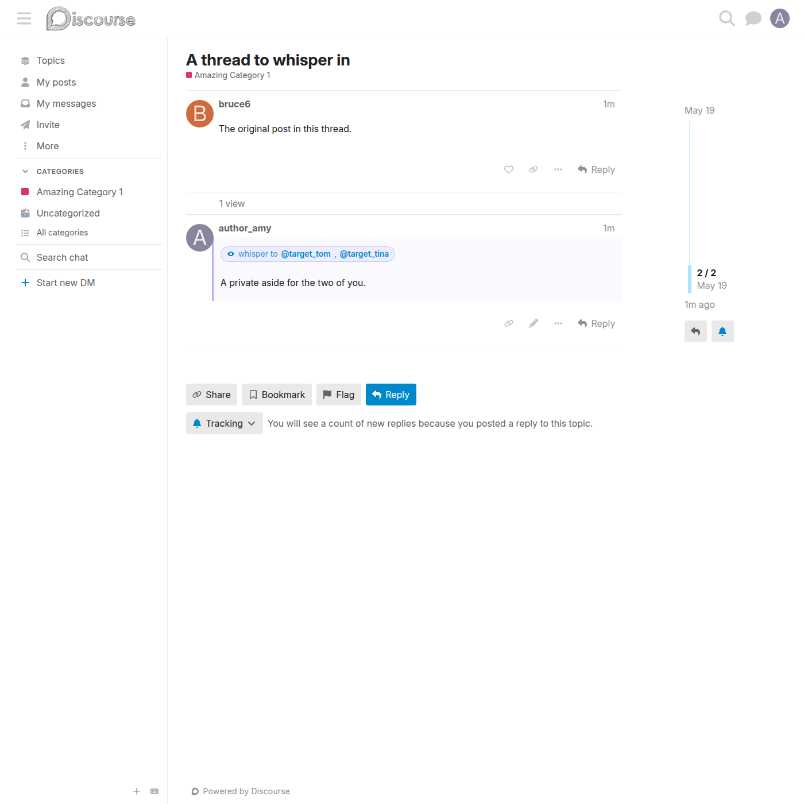

# Whisper a post to chosen users

The core feature: arm any composer post as a whisper to a hand-picked audience.

## How an author sets it

Open the composer (reply or new topic) → click the 👁 **eye** button in the toolbar's `extras` group → pick up to 10 users in the **"Whisper to…"** modal → **Set whisper targets** → write and post as normal.

### The toolbar eye button

The composer toolbar gains a small 👁 eye button — the same visual language Discourse uses for native staff whispers, pointed at a chosen audience instead.

### The "Whisper to…" modal

Clicking the eye button opens a modal with a multi-user picker (an `EmailGroupUserChooser` restricted to users, no groups, capped at 10).

### Picking the recipients

The author selects one or more users as the whisper audience.

### The armed whisper pill

After confirming, an indigo **"Whispering to @user1, @user2"** pill appears above the composer body, and the composer fields pick up a pale indigo tint — so the author can't forget the post is a whisper. The pill's **✕** button cancels the whisper in one click.

### The posted whisper

Once posted, recipients (and the author) see the post with a 👁 `whisper to …` banner above the body and a soft indigo left border.

## Behaviour

- Up to **10** recipients per post (`DiscourseWhisper::MAX_WHISPER_TARGETS`), enforced both in the picker and server-side.
- Reopening the modal preselects the current audience; **Clear whisper targets** reverts the post to a normal one.
- The post is otherwise a completely normal post — same composer, same markdown, same notifications to recipients.

## Storage & API

- **Post custom field:** `whisper_target_user_ids` — a JSON array of user ids.
- The composer serializes it onto the post-create request as `whisper_target_user_ids[]` via `api.serializeOnCreate`.
- The server (`on(:before_create_post)`) coerces, de-dupes, drops bogus ids, caps at 10, and writes the custom field before the post is saved.
- The post serializer exposes `is_whisper_to_user`, `whisper_target_user_ids`, and a richer `whisper_targets` array — all gated on `discourse_whisper_enabled`.

## Related

- [Mention whisper hint](mention-whisper-hint.md) — arm a whisper straight from an `@mention`.
- [Whisper visibility](whisper-visibility.md) — who can read the result.
