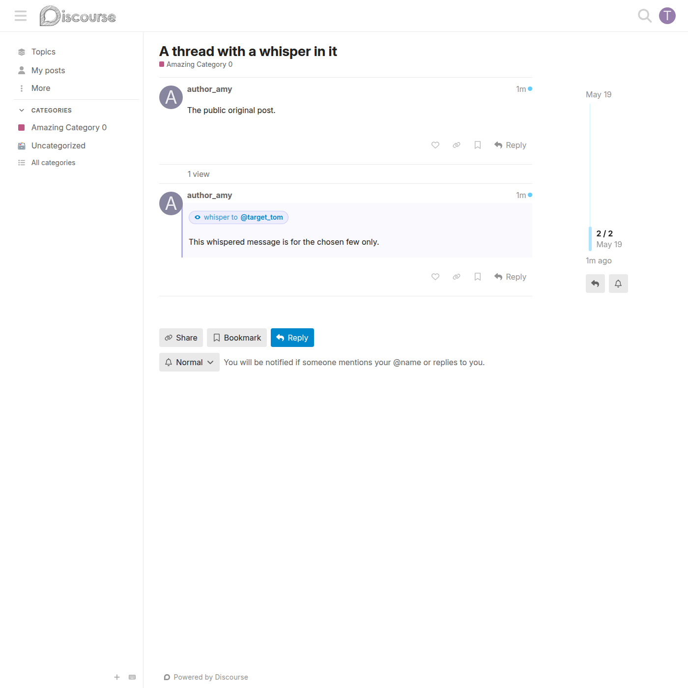
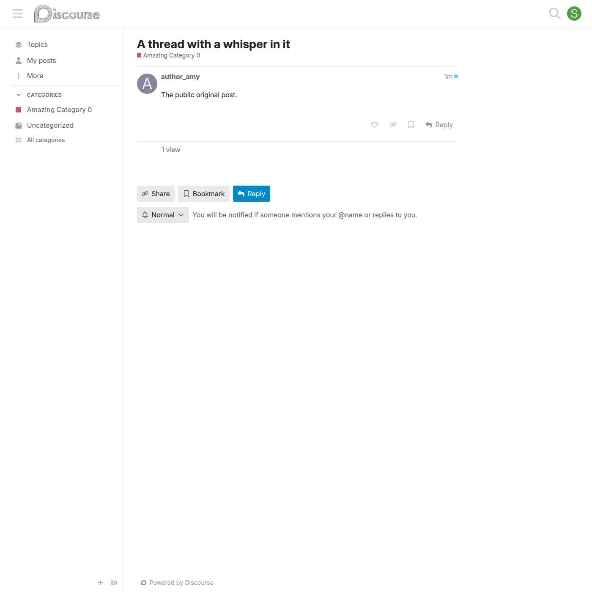
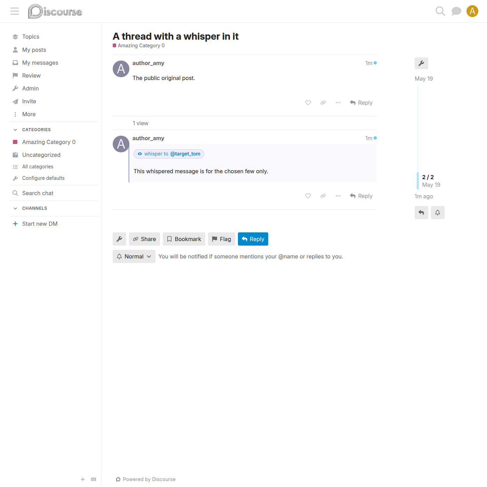
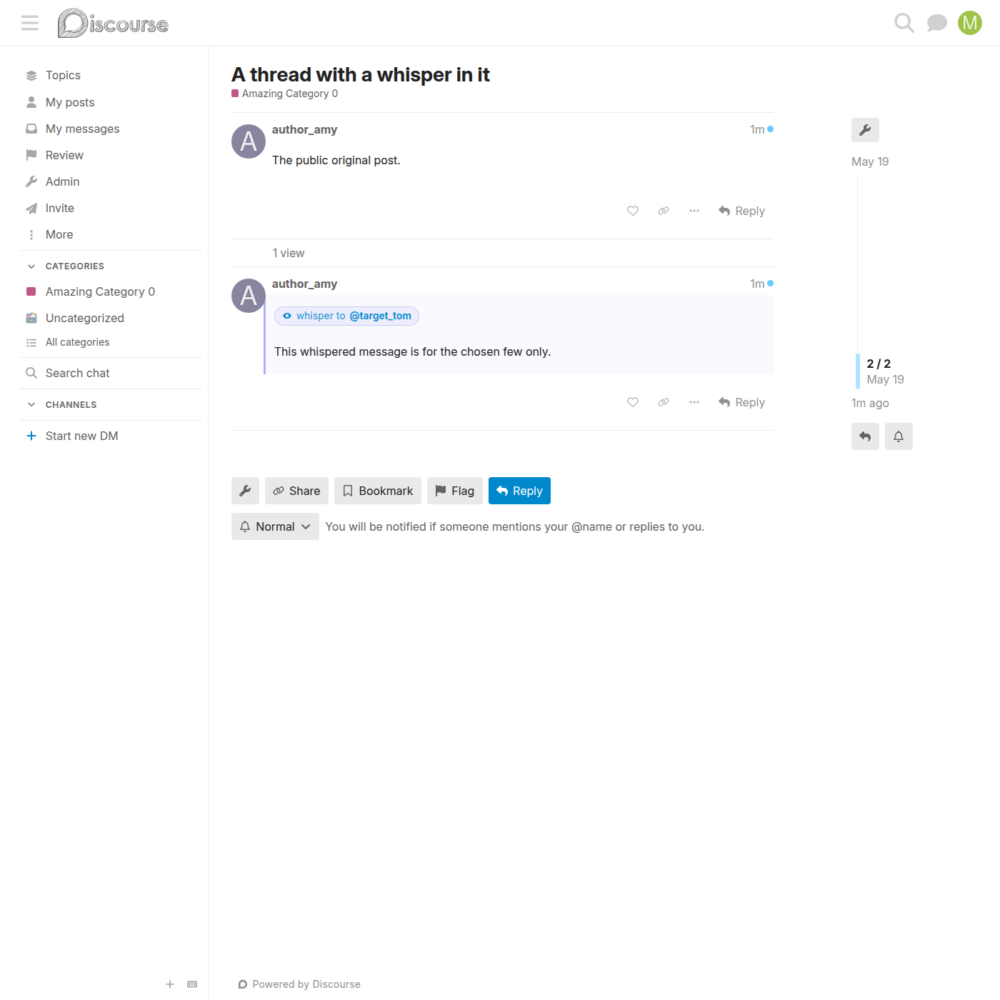
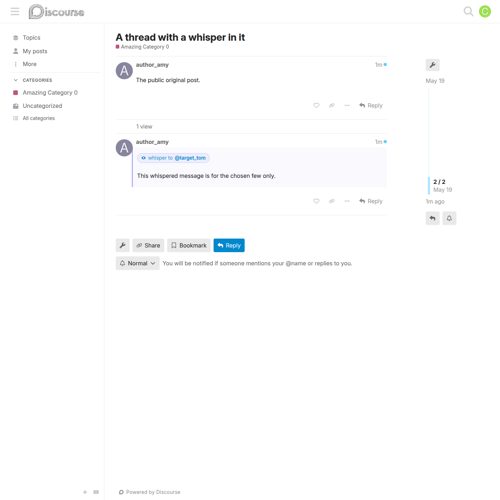
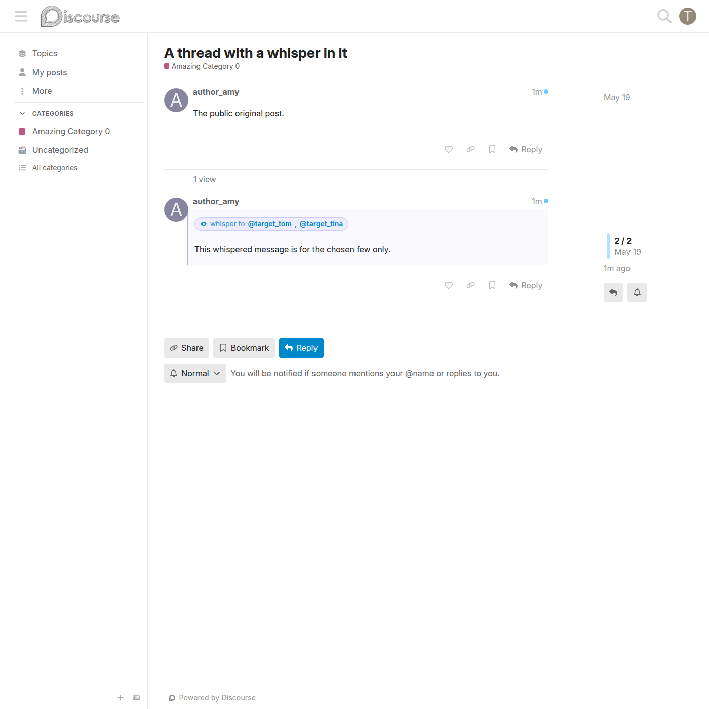
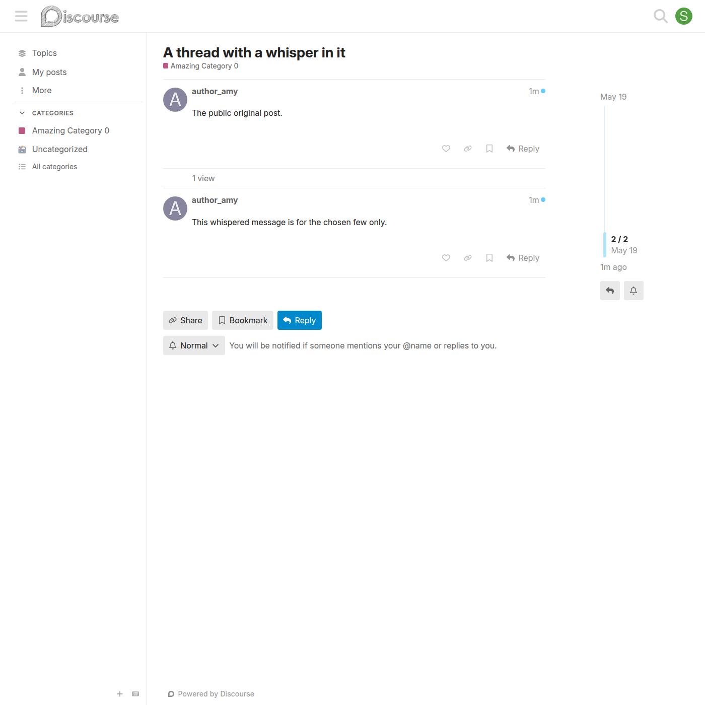

# Whisper visibility & moderator oversight

Who can see a whisper, and how that is enforced across every read path.

## The audience

A whisper post is visible to:

- the **author**
- every **target user** in `whisper_target_user_ids`
- **category group moderators** of the post's category (oversight)
- **site staff** — admins and moderators (oversight)

Everyone else — including anonymous visitors — never sees the post. It is absent from the topic stream entirely; there is no placeholder, stub, or gap.

## The visibility matrix

| Viewer | Mixed-audience whisper | Staff-to-staff whisper |
|---|---|---|
| Author | ✅ | ✅ |
| Any target recipient | ✅ | ✅ |
| Admin | ✅ (oversight) | ✅ (oversight) |
| Moderator | ✅ (oversight) | ✅ (oversight) |
| Category group moderator on that category | ✅ (oversight) | ❌ (no staff-on-staff oversight) |
| Regular user not in the target list | ❌ | ❌ |
| Anonymous viewer | ❌ | ❌ |

**Staff-to-staff** = the author is admin-or-moderator **and** every target resolves to an admin-or-moderator. Category group moderators have no oversight of staff-only conversations, so they are excluded from those.

## What each viewer sees

### A recipient

Recipients see the post with a 👁 `whisper to …` banner above the body and a soft indigo left border.

### A non-recipient

A regular user who is not in the audience sees the topic with the whisper post simply missing.

### A site admin (oversight)

Admins always see whispers so they can review or flag them.

### A site moderator (oversight)

Moderators have the same oversight visibility as admins.

### A category group moderator (oversight)

A category group moderator of the post's category sees mixed-audience whispers in that category.

### A multi-recipient whisper

Every recipient is listed in the banner as a profile link.

## How it is enforced

Visibility is enforced in four places so a whisper cannot leak through any bulk-load path:

1. **`Guardian#can_see_post?`** — the per-post rule (single-post endpoints, revisions, reactions).
2. **`TopicView` custom default scope** — the shared SQL filter applied to the topic stream.
3. **`Search` prepend** — the same SQL filter on search results.
4. **`WebHook` prepend** — whisper posts are dropped from outbound webhook payloads.

The shared SQL filter (`DiscourseWhisper::QueryFilter`) `LEFT JOIN`s `post_custom_fields` and uses Postgres JSONB containment to drop whispers the viewer is not in the audience for. See [architecture.md](architecture.md) for the full layout.

## The master switch

When `discourse_whisper_enabled` is off, none of the above runs — whisper posts become ordinary posts visible to everyone, and the banner is not rendered.

## Related

- [How Whispers Work](whispers.md) — the composer UX and the rule in prose.
- [Architecture](architecture.md) — the three enforcement hooks and the SQL filter.
- [Master switch](discourse-whisper-enabled.md) — the `discourse_whisper_enabled` setting.
